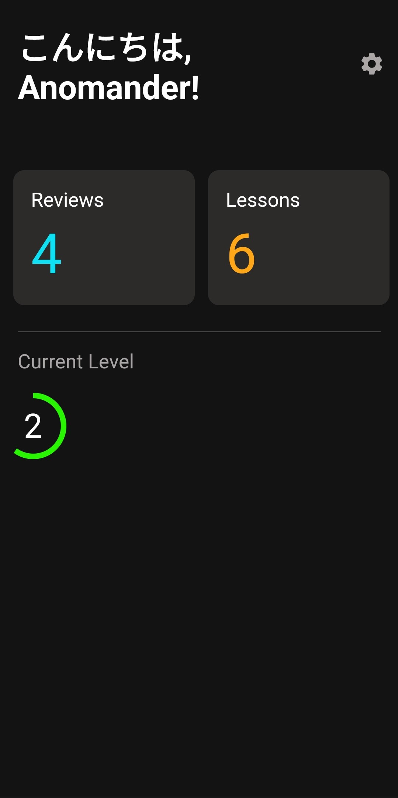
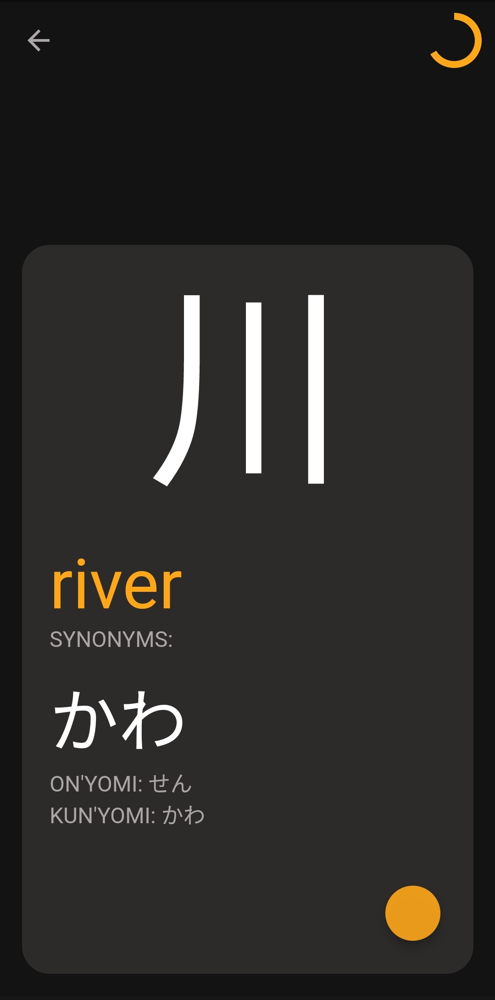
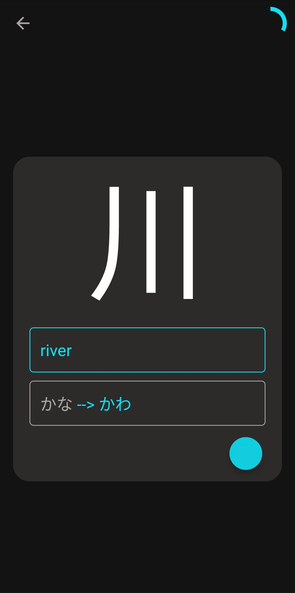
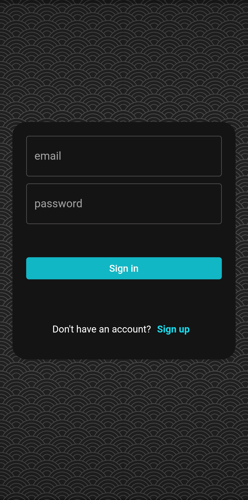

# Kawa: Flutter App for Learning Kanji 
## Flashcard based Kanji learning app which used an SRS model
Users can progress through levels, unlock new kanji and review Kanji based on a Spaced Repetition System. Users can review Kanji through a quiz-like interface which converts their responses into the Japanese script. If they answer incorrectly, then the reviews are conducted more frequently. As the user gets better with a Kanji, their level increases and new Kanji are unlocked.

I used Firebase as the backend for this app. For collecting the Kanji data, I scraped over 1000 Kanji characters from different websites and stored them in a JSON file. I designed the user interface myself, taking inspiration from some other flashcard based apps. I implemented a Spaced Repetition Algorithm, which enables the user to rapidly learn Kanji characters by spacing successive reviews in accordance with user performance. I developed the app with Flutter, utilizing its Provider Package and a kanakit package for translating user iput into the Japanese script.

## Features
  - [x] ~~Login/Signup~~
  - [x] ~~Authorization~~
  - [x] ~~Lessons~~
  - [x] ~~Review Session~~
  - [x] ~~Record the number of times the user answers incorrectly~~
  - [x] ~~Spaced Repitiion Algorithm~~
  - [x] ~~Level Progress~~
  - [x] ~~Confetti Animation~~
  - [ ] Show user progress through graphs
  - [ ] Integrate Radicals and Vocabulary
  - [ ] Detailed view of any Kanji
  - [ ] Forget a Kanji
  
## Gallery

  
   
   
   

